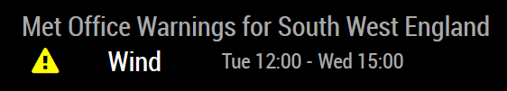
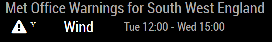

# MMM-UKMOWeatherWarnings

This is a module for the [MagicMirror²](https://github.com/MichMich/MagicMirror/).

This module displays Weather Warnings from the UK Met Office.

 OR 

This module will also send notifications of Weather Warnings for use by other modules.

## Using the module

### Installation
1. Navigate into your MagicMirror's `modules` folder and execute `git clone https://github.com/maloakes/MMM-UKMOWeatherWarnings`.  A new folder `MMM-UKMOWeatherWarnings` will appear.

### Config
To use this module, add a configuration block, similar to this example, to the modules array in the `config/config.js` file:
```js
var config = {
    modules: [
        {
            module: 'MMM-UKMOWeatherWarnings',
            config: {
                // See below for configurable options
                region: 'sw',
                apiBase: 'https://www.metoffice.gov.uk/public/data/PWSCache/WarningsRSS/Region/',
        }
    ]
}
```

## Configuration options

| Option              | Description
|-------------------- |-----------
| `apiBase`           | *Required* UKMO Weather Warnings feed URL <br><br>**Type:** `string` <br>e.g. `https://www.metoffice.gov.uk/public/data/PWSCache/WarningsRSS/Region/`
| `region`            | *Required* UKMO Weather Warnings Region <br><br>**Type:** `string` <br>See table below, e.g. `sw`
| `updateInterval`    | *Optional* Update interval <br><br>**Type:** `int`(milliseconds) <br>Default 900000 milliseconds (15 minutes)
| `retryDelay`        | *Optional* Retry delay <br><br>**Type:** `int`(milliseconds) <br>Default 5000 milliseconds (5 seconds)
| `tableClass`        | *Optional* Size used for table <br><br>**Type:** `string` <br>Default `small`
| `colored`           | *Optional* Whether to color the warning symbol or display level as character <br><br>**Type:** `boolean` <br>Default `true`
| `broadcastCurrent`  | *Optional* Whether to send notifications for current warnings <br><br>**Type:** `boolean` <br>Default `false`
| `broadcastForecast` | *Optional* Whether to send notifications for warnings during forecast period <br><br>**Type:** `boolean` <br>Default `false`
| `broadcastListSize` | *Optional* Size (i.e. number of days) of the forecast list <br><br>**Type:** `int` <br>Default 5
| `useTestData`       | *Optional* Whether to use test data instaed of the live feed <br><br>**Type:** `boolean` <br>Default `false`
| `testUrl`           | *Optional* URL of the test data file  <br><br>**Type:** `string` <br>e.g. `http://localhost:8080/modules/MMM-UKMOWeatherWarnings/public/warns.json`
| `backgroundMode`    | *Optional* Whether to run in background mode, only sending notifications <br><br>**Type:** `boolean` <br>Default `false`
| `delta`             | *Optional* Look ahead delta for current warnings <br><br>**Type:** `int`(minutes) <br>0

#### Regions
| Code | Region
|------|---------------------
| os   | Orkney & Shetland
| ta   | Central, Tayside & Fife
| he   | Highlands & Eilean Siar
| gr   | Grampian
| st   | Strathclyde
| dg   | Dumfries, Galloway, Lothian & Borders
| ni   | Northern Ireland
| wl   | Wales
| nw   | North West England
| ne   | North East England
| yh   | Yorkshire & Humber
| wm   | West Midlands
| em   | East Midlands
| ee   | East of England
| sw   | South West England
| se   | London & South East England

## Notifications
This module can send notifications of weather warnings.
The module can be run in background mode to send the notifications without displaying the data itself.

Example payload item;
`{ level: "A", color: "orange", type: "Snow" }`

| Notification               | Payload
|----------------------------|-----------------------------------------
| `WEATHER-WARNING-CURRENT`  | Highest level alert for the current period
| `WEATHER-WARNING-FORECAST` | Array of highest level alert for each day of forecast period

## Test Data
Test data can be generated, since we don't get warnings all of the time.

1. Navigate into your MagicMirror's `modules/MMM-UKMOWeatherWarnings/testing` folder.
2. Execute `node createDummyWarnings.js`
3. A file, `warns.json` will be generated in your modules `public` folder
4. Edit your config.js file to set `useTestData` and `testUrl`
5. Start/Restart your mirror
